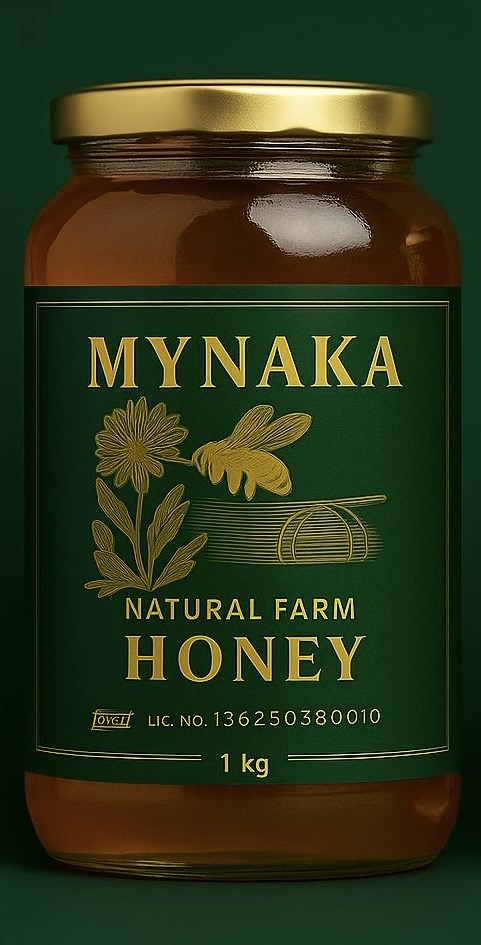
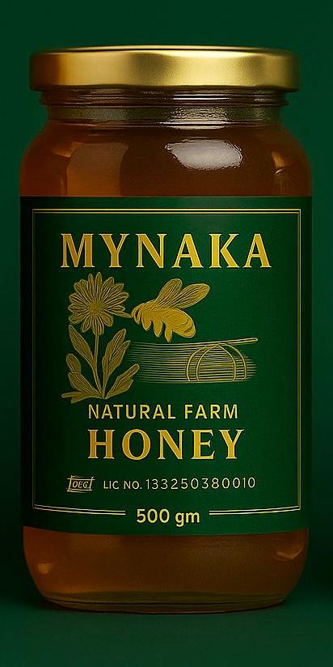
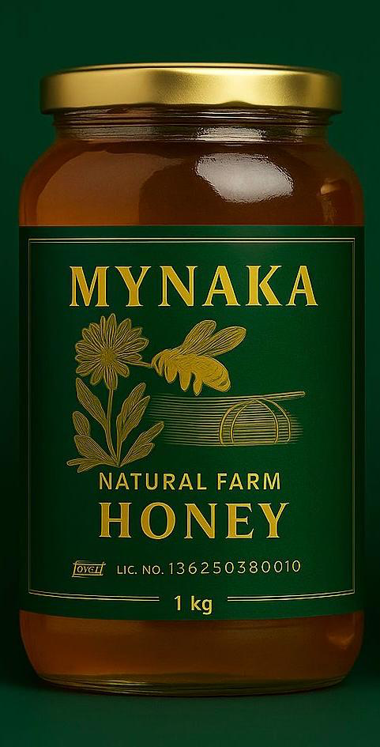

# YOUR_GITHUB_USERNAME.github.io.
<!DOCTYPE html>
<html lang="en">
<head>
  <meta charset="UTF-8" />
  <meta name="viewport" content="width=device-width, initial-scale=1.0" />
  <title>Mynaka Honey Shop</title>
  <link rel="stylesheet" href="styles.css">
</head>
<body>
  <header class="hero">
    <h1>Pure Multiflora Honey</h1>
    
Ethically harvested • 250g / 500g / 1000g packs

  </header>

  <section class="products">
    

      
      <h2>250g – ₹199</h2>
    

    

      
      <h2>500g – ₹399</h2>
    

    

      
      <h2>1000g – ₹699</h2>
    

  </section>

  <section class="payment">
    <h2>Pay via PhonePe</h2>
    
    
UPI ID: <strong>Vitla.samrat@ybl</strong>

  </section>

  <section class="contact">
    <h2>Contact & Order</h2>
    
📞 9000582083 • 9502108035 • 8686484908

    
📧 mynaka.info@gmail.com

    
📸 Instagram: <a href="https://instagram.com/honey.natural.organic" target="_blank">@honey.natural.organic</a>

  </section>

  <footer>
    
&copy; Mynaka Honey 2025

  </footer>
</body>
</html>
